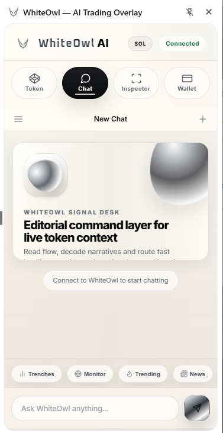
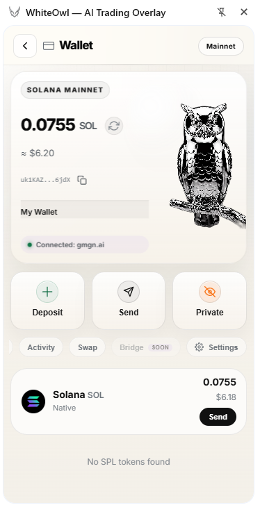
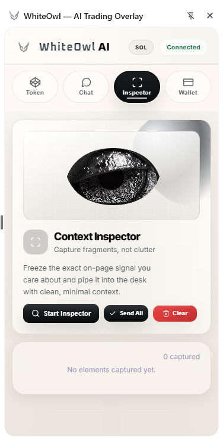
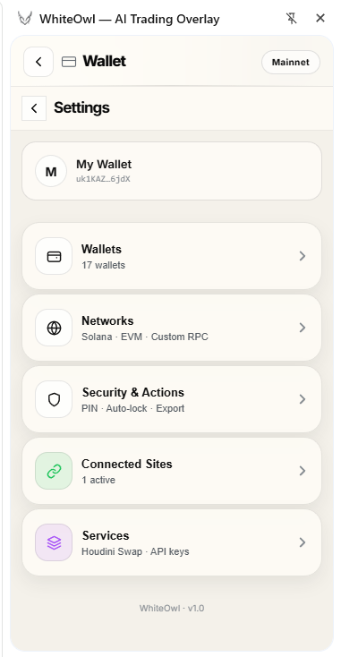

# WhiteOwl Extension

Open-source browser extension and wallet companion for the WhiteOwl panel.

## Product Preview

<p align="center">
	<video src="./ex.mp4" controls muted playsinline preload="metadata" poster="./screenshots/chat-surface.png" width="100%"></video>
</p>

<p align="center">
	Browser-side chat, wallet, inspector and context capture running inside the WhiteOwl extension side panel.
</p>

<p align="center">
	<a href="./ex.mp4">Open preview video</a> •
	<a href="https://github.com/whiteowl-engine/WhiteOwl-Extension/releases/latest">Latest release</a> •
	<a href="https://github.com/whiteowl-engine/WhiteOwl">Main WhiteOwl panel</a>
</p>

This repository is intended to be the standalone split of the extension layer that works next to the main WhiteOwl panel/backend. It contains the Chrome Manifest V3 extension, side panel UI, provider bridge, wallet flows, token context overlays, page inspection tools, and local integration points for the WhiteOwl runtime.

## WhiteOwl Stack

WhiteOwl is split into two repositories that are designed to run together:

- Main panel and backend: `https://github.com/whiteowl-engine/WhiteOwl`
- Browser wallet and side panel extension: `https://github.com/whiteowl-engine/WhiteOwl-Extension`

The main WhiteOwl repo is the dashboard, local backend runtime, AI agent layer, automation surface, market data plane, and chat server. This extension repo is the in-browser wallet, provider bridge, site connection layer, inspector, and page-aware side panel. Together they form the full WhiteOwl operator workflow.

## Screenshots

<table>
	<tr>
		<td width="50%" valign="top">
			
			<p><strong>Wallet surface</strong><br>Balances, quick wallet actions, active site context, and token holdings inside the browser side panel.</p>
		</td>
		<td width="50%" valign="top">
			
			<p><strong>Chat surface</strong><br>Panel-linked WhiteOwl chat available directly inside the extension side panel.</p>
		</td>
	</tr>
	<tr>
		<td width="50%" valign="top">
			
			<p><strong>Inspector surface</strong><br>Capture page fragments and route clean context from the browser into the WhiteOwl desk.</p>
		</td>
		<td width="50%" valign="top">
			
			<p><strong>Wallet settings</strong><br>Wallet, network, security, connected site, and service controls in the extension settings layer.</p>
		</td>
	</tr>
</table>

## Install

1. Start the main WhiteOwl panel/backend from `https://github.com/whiteowl-engine/WhiteOwl`.
2. Download the latest packaged build from `https://github.com/whiteowl-engine/WhiteOwl-Extension/releases/latest` or clone this repository for unpacked installation.
3. Open `chrome://extensions`, enable Developer mode, then load the unpacked repository or extracted release archive.
4. Keep the default server target `http://localhost:3377` or point `wo_server_url` to your running WhiteOwl panel.
5. Pin the extension, open the side panel, and use the wallet, chat, inspector and page-aware WhiteOwl flows directly in the browser.

## What This Repo Contains

- Manifest V3 browser extension for Chrome and Chromium-based browsers
- Side panel UI for token analysis, chat, inspector, and wallet flows
- Provider bridge injected into supported Solana and trading surfaces
- Site approval and connection management logic
- Page data inspection and safety/scanner flows
- Local-first wallet and keystore logic stored in extension storage

## What This Repo Does Not Contain

- The main WhiteOwl panel/backend application
- Backend API implementation
- Hosted infrastructure or cloud deployment config
- A packaged Web Store release artifact

By default the extension expects a WhiteOwl panel/backend at `http://localhost:3377`. The backend URL can be changed through extension storage by setting `wo_server_url`.

## Repository Layout

- `manifest.json` - extension manifest and permissions
- `background.js` - background service worker, message relay, backend bridge
- `content.js` - page overlays, page analysis, scanner and capture logic
- `provider.js` - injected wallet/provider bridge for supported sites
- `sidepanel.html` - side panel markup
- `sidepanel.css` - side panel styles
- `sidepanel.js` - side panel application logic and wallet UI flows
- `i18n-ext.js` - runtime translation helper
- `_locales/en/messages.json` - English store metadata strings
- `lightweight-charts.js` - bundled third-party chart library with preserved license header
- `scripts/validate.mjs` - repository hygiene and syntax validator

## Core Features

- Token context side panel for live market and page-aware analysis
- WhiteOwl chat entry point inside the browser side panel
- Page inspector for capturing structured on-page context into the panel
- Local wallet flows for PIN, keystore, signing, import and recovery
- dApp/provider bridge for supported Solana surfaces
- Safety-oriented site connection review and page scanning
- Local bridge to the WhiteOwl panel for token, image, scanner and wallet actions

## Development

### Requirements

- Chrome or another Chromium browser with Manifest V3 support
- Node.js 20 or newer for validation scripts
- WhiteOwl panel/backend running locally or reachable through a configured backend URL

### Load Unpacked

1. Open `chrome://extensions`.
2. Enable Developer mode.
3. Select Load unpacked.
4. Choose this repository root.
5. Pin the extension and open the side panel.

### Validation

Run the repository validation before publishing or tagging:

```bash
npm run check
```

The validator checks:

- JavaScript syntax for the extension entry files
- Presence of Cyrillic characters across tracked text files
- Comment markers in extension source files

The bundled `lightweight-charts.js` file is intentionally excluded from the comment check because its Apache 2.0 license header must remain intact.

### Releases

Tagged versions publish a packaged browser-extension archive into GitHub Releases.

- Releases page: `https://github.com/whiteowl-engine/WhiteOwl-Extension/releases`
- Release asset format: `whiteowl-extension-v<version>.zip`
- Packaging command: `npm run package:release`

The release archive is built from the runtime extension files only, so it can be downloaded and loaded directly as an unpacked extension after extraction.

### Packages

This repository also publishes the source package to GitHub Packages.

- Package name: `@whiteowl-engine/extension`
- Registry: `https://npm.pkg.github.com`

Preview the publish payload locally:

```bash
npm run package:preview
```

## Backend Integration

The extension is not a fully isolated product. It is a companion layer for the WhiteOwl panel.

- Default API target: `http://localhost:3377`
- Local override key: `chrome.storage.local.wo_server_url`
- Expected backend responsibilities include token enrichment, image scanning, panel chat/runtime integration, and selected wallet-related server endpoints

If the backend is offline, the extension UI still loads, but features that depend on the panel runtime will degrade or stay unavailable.

## Permissions Summary

- `activeTab` - current page interactions initiated by the user
- `sidePanel` - browser side panel UI
- `storage` - local extension state, approvals, keystore and settings
- `tabs` - tab messaging and active page coordination
- `webRequest` - request inspection or compatibility logic used by the extension runtime
- `cookies` - site/session interoperability where required by the extension flows
- `alarms` - background timing and retry flows

The extension also injects content scripts and provider logic into the trading, wallet and social domains listed in `manifest.json`.

## Security Notes

- This repository includes wallet-related code and local signing flows.
- The codebase should be reviewed carefully before using it with real funds.
- Keep the backend local unless you explicitly trust the configured WhiteOwl server.
- Review `SECURITY.md` before publishing production builds.

## Privacy Notes

- The extension stores operational state locally in extension storage.
- Data collection and provider-side activation are consent-gated in the UI.
- Review `PRIVACY.md` for a concrete breakdown of storage and network behavior.

## Third-Party Code

This repository currently vendors TradingView Lightweight Charts in `lightweight-charts.js`.

- License: Apache License 2.0
- Notice file: `THIRD_PARTY_NOTICES.md`